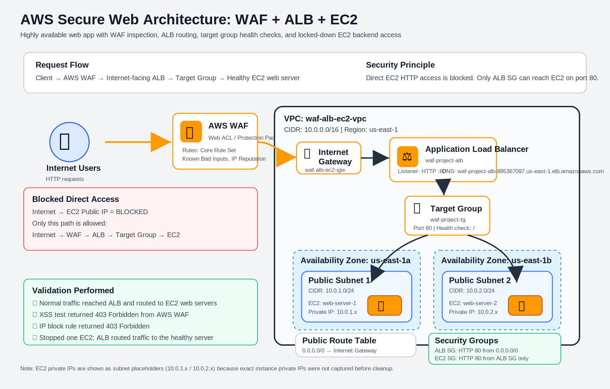

# 🔐 AWS Secure Web Architecture: WAF + ALB + EC2 (Highly Available)

## 📌 Project Overview

This project demonstrates a **secure, highly available web application architecture on AWS** using:

- AWS WAF (Web Application Firewall)
- Application Load Balancer (ALB)
- EC2 instances (2 web servers)
- Target Groups & Health Checks
- Custom VPC, Subnets, and Routing

The architecture protects against common web attacks (XSS, SQL injection), ensures high availability across Availability Zones, and enforces secure backend access.

---

## 🧠 Architecture (Logical Flow)

```
Internet
   ↓
AWS WAF (filters malicious traffic)
   ↓
Application Load Balancer (ALB)
   ↓
Target Group
   ↓
EC2 Instance 1     EC2 Instance 2
(AZ-1)             (AZ-2)
```

---

## 🌐 Network Architecture (Detailed)

```
VPC: 10.0.0.0/16
│
├── Public Subnet 1 (10.0.1.0/24) - AZ-1
│    └── EC2 Instance 1
│
├── Public Subnet 2 (10.0.2.0/24) - AZ-2
│    └── EC2 Instance 2
│
├── Internet Gateway (IGW)
│
├── Route Table
│    └── 0.0.0.0/0 → IGW
│
└── Application Load Balancer (across both subnets)
```

---

## 🧩 Services Used & Explanation

### 1. VPC (Virtual Private Cloud)
- Provides isolated AWS network environment
- CIDR: `10.0.0.0/16`
- Allows creation of subnets and routing control

---

### 2. Subnets (Public)
- `10.0.1.0/24` (AZ-1)
- `10.0.2.0/24` (AZ-2)
- Configured with **Auto-assign Public IP**
- Enables internet-facing resources

---

### 3. Internet Gateway (IGW)
- Connects VPC to the internet
- Required for public access

---

### 4. Route Table
- Route: `0.0.0.0/0 → IGW`
- Enables inbound/outbound internet traffic

---

### 5. EC2 Instances (Web Servers)
- 2 instances deployed across different AZs
- Apache installed via User Data
- Each server returns unique message:
  - Server 1
  - Server 2

---

### 6. Security Groups

#### ALB Security Group
- Allows:
  - HTTP (80) from `0.0.0.0/0`

#### EC2 Security Group
- Allows:
  - HTTP (80) ONLY from ALB Security Group
  - SSH (22) from My IP

🔐 Prevents direct internet access to EC2

---

### 7. Target Group
- Registers EC2 instances
- Performs health checks on `/`
- Only routes traffic to **healthy instances**

---

### 8. Application Load Balancer (ALB)
- Internet-facing
- Distributes traffic across EC2 instances
- Provides **high availability**
- Automatically skips unhealthy targets

---

### 9. AWS WAF (Web Application Firewall)
- Attached to ALB
- Uses managed rules:
  - Core Rule Set
  - Known Bad Inputs
  - IP Reputation List
- Protects against:
  - XSS attacks
  - SQL injection
  - Malicious IPs

---

## 🔐 Security Design

```
Internet ❌ → EC2 (Blocked)
Internet ✅ → WAF → ALB → EC2 (Allowed)
```

- EC2 is NOT directly accessible
- All traffic must pass through WAF + ALB

---

## 🧪 Testing & Validation

### ✅ 1. Load Balancing Test
- Refresh browser
- Traffic alternates between:
  - Server 1
  - Server 2

---

### 🚨 2. WAF Attack Simulation

Tested:

```
http://ALB-DNS/?q=<script>alert(1)</script>
```

Result:

```
403 Forbidden
```

✔ WAF successfully blocked XSS attack

---

### 🔍 3. WAF Logs

- Observed blocked requests in WAF dashboard
- Verified rule match and action

---

### 🚫 4. IP Blocking Test

- Created custom IP rule
- Blocked own IP

Result:

```
403 Forbidden
```

✔ Demonstrates manual threat blocking

---

### ⚙️ 5. High Availability Test (Failover)

- Stopped one EC2 instance

Observed:

- Target group marked instance unhealthy
- ALB routed traffic to healthy instance

✔ No downtime

---

## 💰 Cost Optimization

- Used **Essential WAF rules only**
- Avoided:
  - Bot Control (expensive)
  - Advanced managed rules
- Used:
  - t2.micro instances
  - Minimal resources

---

## 📸 Screenshots

```
screenshots/
├── 01-vpc-created.png
├── 02-subnets-created.png
├── 03-subnet-public-ip-enabled.png
├── 04-internet-gateway-attached.png
├── 05-route-table.png
├── 06-subnet-associated.png
├── 07-ec2-running.png
├── 08-ec2-server1.png
├── 09-ec2-server2.png
├── 10-target-group-targets.png
├── 11-target-group-healthy.png
├── 12-alb-created.png
├── 13-alb-working.png
├── 14-ec2-sg-locked.png
├── 15-ec2-direct-blocked.png
├── 16-waf-overview.png
├── 17-waf-rules.png
├── 18-waf-alb-attached.png
├── 19-waf-dashboard.png
├── 20-waf-blocked.png
├── 21-waf-ip-block.png
├── 22-alb-failover.png
```


## 🖼️ Architecture Diagram

<p align="center">
  
</p>
---


## 🧠 Key Learnings

- How to design **secure cloud architecture**
- Importance of **layered security (WAF + ALB + SG)**
- Implementing **high availability across AZs**
- Using **health checks for fault tolerance**
- Understanding **WAF rule behavior (BLOCK vs COUNT)**
- Cost optimization in AWS

---

## 🎯 Resume Highlights

- Designed and deployed a secure AWS web architecture using WAF, ALB, and EC2 across multiple AZs  
- Implemented WAF managed rules to mitigate XSS and SQL injection attacks  
- Configured ALB with health checks and failover for high availability  
- Secured backend instances using security group restrictions  
- Tested system resilience by simulating attacks and instance failure scenarios  

---

Include:
- VPC (10.0.0.0/16)
- Subnets (10.0.1.0/24, 10.0.2.0/24)
- ALB
- WAF
- Target Group
- EC2 Instances
- Internet Gateway

---

## 🚀 Future Improvements

- Add HTTPS (SSL via ACM)
- Use Auto Scaling Group instead of manual EC2
- Enable CloudWatch logs for WAF
- Add CloudFront CDN

---

## 👤 Author

**Syed Abdul Basit Aftab**

---
